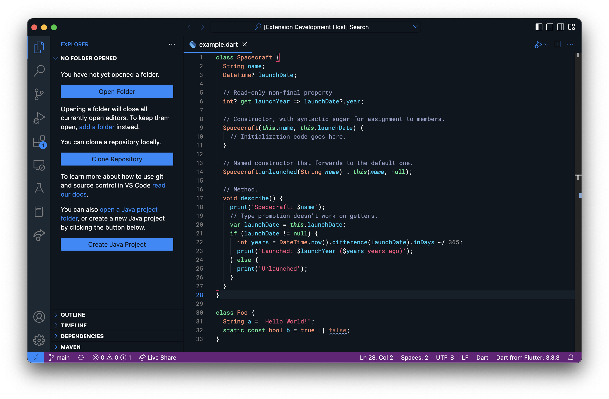

# DartPad Theme

Unoficcial theme inspired by [DartPad](https://www.dartpad.dev/).

## Preview



DartPad theme with [Roboto Mono](https://fonts.google.com/specimen/Roboto+Mono) font family.

## Activate theme

Open the [Command Palette](https://code.visualstudio.com/api/ux-guidelines/command-palette):

  -  <a href="https://code.visualstudio.com/shortcuts/keyboard-shortcuts-linux.pdf">Linux</a> `Ctrl + Shift + P`
  -  <a href="https://code.visualstudio.com/shortcuts/keyboard-shortcuts-macos.pdf">macOS</a> `⌘ + Shift + P`
  -  <a href="https://code.visualstudio.com/shortcuts/keyboard-shortcuts-windows.pdf">Windows</a> `Ctrl + Shift + P`

Type `Preferences: Color Theme`, and select `DatPad`.

## How to change the font to match DartPad

First install the [Roboto Mono](https://fonts.google.com/specimen/Roboto+Mono) in your system's fonts. Then add this setting to your Visual Studio Code `settings.json` file:

```json
    "editor.fontFamily": "Roboto Mono"
```

For more information on how settings work, check the [Visual Studio Code documentation](https://code.visualstudio.com/docs/getstarted/settings).